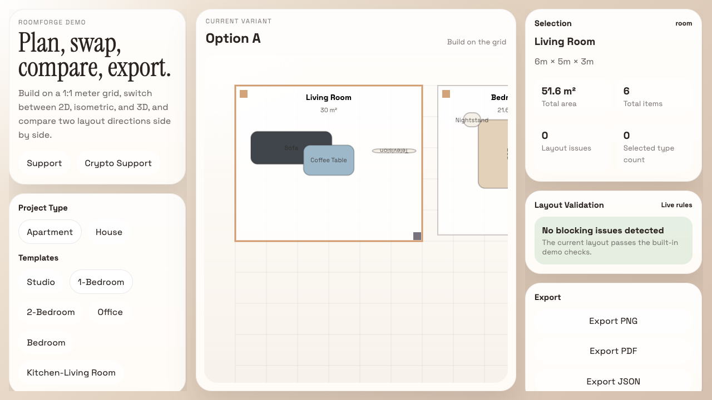

# RoomForge

RoomForge is a browser-based interior planning demo for fast layout exploration, furniture swapping, and presentation-ready review.



## Why this project exists

Most room planners force a tradeoff between technical floor-plan editing and visual presentation. RoomForge exists to collapse that gap into one workflow:

- build quickly on a 1:1 meter grid
- evaluate the same project in 2D and isometric
- replace furniture variants without leaving the scene

## Features

- `Apartment / House` project types
- ready-made templates for `Studio`, `1-Bedroom`, `2-Bedroom`, `House 80 m²`, `House 120 m²`, `Office`, `Bedroom`, and `Kitchen-Living Room`
- shared planner state across `2D` and `Isometric`
- categorized furniture library with five variants per item tier: `Compact`, `Standard`, `Premium`, `Minimal`, `Statement`
- right-side inspector with selection details, color changes, replacement options, duplication, locking, rotation, and deletion
- drag-and-drop placement in the 2D planner
- live layout validation checks

## Modes

- `2D`: primary planning mode with a meter grid, room resizing, room movement, and item placement
- `Isometric`: cutaway presentation mode for polished layout review

## Templates

- Studio
- 1-Bedroom
- 2-Bedroom
- House 80 m²
- House 120 m²
- Office
- Bedroom
- Kitchen-Living Room

## Styles

- Minimal
- Scandinavian
- Japandi
- Loft
- Warm Neutral
- Modern Classic

## Lighting

- Day
- Evening
- Warm Light
- Cool Light
- Night

## How to run

```bash
npm install
npm run dev
```

Build for production:

```bash
npm run build
```

## Demo deployment

The project is Vite-based and ready for Vercel deployment. The included [`vercel.json`](./vercel.json) routes all requests to the SPA entry.

## How to contribute

See [`CONTRIBUTING.md`](./CONTRIBUTING.md) for local setup, scope guidance, and contribution expectations.

## Good first issue

- add richer door/window authoring to the 2D planner
- improve library search and room-aware recommendations
- split heavy scene bundles with dynamic imports
- add dedicated Playwright coverage for both 2D and isometric modes

## Roadmap

See [`ROADMAP.md`](./ROADMAP.md).

## Support

- [Support the project](https://github.com/sponsors)
- [Crypto support](https://commerce.coinbase.com/)
